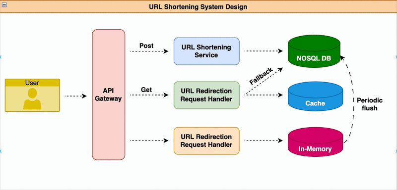

# 🔗 High-Performance URL Shortener System

[](https://opensource.org/licenses/Apache-2.0)
[](https://www.python.org/)
[](https://fastapi.tiangolo.com/)
[](https://www.mongodb.com/)
[](https://redis.io/)
[](https://locust.io/)

A scalable, high-performance URL shortener backend API built with modern technologies. This system is designed for low-latency redirects, real-time analytics, and resilience under heavy load, leveraging Redis for caching and MongoDB for flexible data storage.

---

## 📊 System Architecture



---

## 🚀 How to Run

### 🔧 1. Start All FastAPI Servers (Ports 8000, 8001, 8002)

```bash
./run_all.sh
```

This starts 3 FastAPI instances to simulate a load-balanced backend.

---

### 🧪 2. Run Locust Load Test (2000 Users)

```bash
./run_stress_test.sh
```

Or manually:

```bash
locust -f app/locustfile.py \
  --headless \
  -u 2000 \
  -r 500 \
  --run-time 3m \
  --csv=results/loadtest \
  --host=http://localhost
```

Outputs will be saved in `results/`:

* `loadtest_stats.csv`
* `loadtest_failures.csv`
* `loadtest_stats_history.csv`

---

### 🧪 3. Run Unit Tests

```bash
pytest tests/
```

---

## 🛠 Tech Stack

* **FastAPI** – high-speed async web server
* **MongoDB** – stores long-to-short URL mappings
* **Redis** – caches hot URL entries and tracks view counts
* **Locust** – load testing framework for HTTP users
* **Uvicorn** – ASGI server with multiple workers
* **Pytest** – test framework for backend APIs

---

## 📌 API Endpoints

| Method | Endpoint                | Description                       |
| ------ | ----------------------- | --------------------------------- |
| POST   | `/shorten`              | Shorten a long URL                |
| GET    | `/{short_id}`           | Retrieve the original long URL    |
| GET    | `/analytics/{short_id}` | View access stats for a short URL |

---

## ✨ Future Improvements

* User authentication and rate limiting
* QR code generation
* Geo-based analytics
* Full deployment with Docker and reverse proxy
* Horizontal scaling with MongoDB + Redis clustering

---
